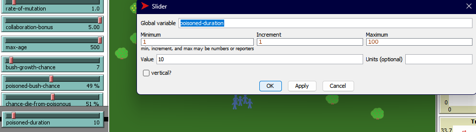

## Комп'ютерні системи імітаційного моделювання
## СПм-22-4, **Кононенко Олександр Миколайович**
### Лабораторна робота №**2**. Редагування імітаційних моделей у середовищі NetLogo

 

### Варіант 13, модель у середовищі NetLogo:
Fruit Wars. При генерації куща, з деякою ймовірністю (вказаною користувачем) він може стати отруйним. Після завершення збору ресурсів з куща, якщо кущ був отруйний, здобувач або помирає, або виживає (ймовірність виживання залежить від сили здобувача). Якщо здобувач їжі вижив після отруєння, він отримує зниження параметра швидкості на певну кількість тактів (вказану у внутрішніх параметрах). Отруйні кущі мають інший колір ягід на мапі. На графіку "Deaths By Type" додається новий тип смертності "від отруєння".

### Внесені зміни у вихідну логіку моделі, за варіантом:

Додав властивість до **fruit-bushes-own**:
<pre>isPoisonous?</pre>
Для отруйності дерев.

Після чого створив важіль для налаштування вірогідності створення отруйного дерева користувачем(за замовчуванням 50):

Та змінив процедуру **grow-fruit-bushes** для залучення дерев отруйними
<pre>
to grow-fruit-bushes [ num-bushes ] ; procedure to create fruit-bushes on a grid without overlap
  ask n-of num-bushes patches with ; only spawn new bushes on patches spaced 3 apart
  [
    pxcor mod 3 = 0
    and pycor mod 3 = 0
    and (abs (pycor - max-pycor)) > 1 ; avoid being to closer to the edge
    and (abs (pxcor - max-pxcor)) > 1
    and (abs (pycor - min-pycor)) > 1
    and (abs (pxcor - min-pxcor)) > 1
    and not any? fruit-bushes-here
  ]
  [
    let bushPoisonous random 100 < poisoned-bush-chance
    sprout-fruit-bushes 1
    [
      set shape "Bush"
      set color ifelse-value (bushPoisonous) [lime] [one-of [ red blue orange yellow ]]
      set amount 500 + random 501
      set size 3
      set isPoisonous? bushPoisonous
    ]
  ]
end
</pre>

Відтепер коли фуражер намагається зібрати плоди з отруйного дерева - він вмирає. Для виконання завдання по варіанту додав вірогідність померти або вижити після торкання отруйного дерева у залежності від показнику сили. Був доданий наступний фрагмент коду у процедуру **forage**:
<pre>
  if-else strength < 27  ;; Середній показник сили фуражерів
    [
      set poisoned-death-count poisoned-death-count + 1
      die
    ]
</pre>

Для подальших змін, таких як *Якщо здобувач їжі вижив після отруєння, він отримує зниження параметра швидкості на певну кількість тактів (вказану у внутрішніх параметрах).* додаю нові змінні:
<pre>
poisonous-slow
</pre>
Для відрахунку впливу отруєння. Та
<pre>
poisonous-deaths
poisonous-deaths-rate
</pre>
Для додання статистичних даних. Після цього додав логіку отруєння:
У процедуру **forage** додав такі зміни:
<pre>
to forage ; forager procedure
  let forage-rate 0
  let bushPoisonous false
  if-else any? other foragers in-radius 0.1 with [foraging?]
  [ ; set foraging rate based on average group intelligence and collab-bonus
    let i-n sum [intelligence] of foragers in-radius 0.1 with [foraging?]
    let i-d (count foragers in-radius 0.1 with [foraging?]) * 20
    let i-ratio i-n / i-d
    set forage-rate i-ratio * 10 * collaboration-bonus
  ]
  [
    set forage-rate 10
  ]

  ask one-of fruit-bushes in-radius 0.1
    [
    set amount amount - 10
    if (amount < 0) [ die ]
    set bushPoisonous isPoisonous?
  ]
  set energy energy + forage-rate
  set num-forages num-forages + 1
  set total-foraged total-foraged + forage-rate

  if bushPoisonous[
  if-else strength < 27  ;; Середній показник сили фуражерів
    [
      set poisonous-deaths poisonous-deaths + 1
      die
    ]
    [
      if poisonous-slow <= 0
      [
        set poisonous-slow 100
        set speed speed * 0.1
        set energy energy - 50
        set color yellow
      ]
    ]
  ]
end
</pre>
У змінну **move-foragers** замінив:
<pre>
if energy > 200[ ; reproduce
</pre>
на 
<pre>
if energy > 200 and poisonous-slow <= 0
</pre>
Для урахування фактору отруєнності для розмноження. А також додав туди:
<pre>
if poisonous-slow = 1[
    set speed get-speed
    set color yellow
    ]
set poisonous-slow poisonous-slow - 1
</pre>
Для сповільнення отруєних фуражерів, зміни їх кольору на жовтий та можливості одужання.
Вніс необхідні зміни, додавши до частин коду, де фуражер помирає від отруєння:
<pre>
poisonous-deaths + 1
</pre>
А також додав слайдер шансу померти від отруєння:

Та логіку у вигляді:
<pre>
if bushPoisonous[
  if-else strength < 27 * chance-die-from-poisonous
...
</pre>
Після внесених змін симуляція виглядає наступним чином:

### Внесені зміни у вихідну логіку моделі, на власний розсуд:
Додано можливість змінити кількість тактів, скільки отруєнний агент буде отруєний, а відповідно сповільнений:

Та зробив зміну у процедурі **move-foragers**:
<pre>
if poisonous-slow = 1[
    repeat poisoned-duration [ set speed 0
        set color yellow ]
    ]
</pre>

Для виключення такої ситуації, що система споживає надто багато ресурсів ЕОМ, приклад:

Було додано обмежувач максимальної кількості агентів:

Та видачу повідомлення за такою логікою:
<pre>
to go
  if count foragers > max-foragers [ user-message "Too much foragers" stop ]
  if not any? foragers [ stop ]
...
</pre>
Відтепер симуляція автоматично зупинюється у двох випадках - коли кількість форажерів перевищує задану користувачем та коли не залишилось жодного фуражера.

 

## Обчислювальний експеримент
### Залежність середньої кількості фуражерів від шансу померти від отруєння:
Досліджується вплив **chance-die-from-poisonous** на **Avg Population** протягом 2000 тактів. Керуючі параметри за замовчуванням:
- initial-fruit-bushes - 40
- initial-foragers - 100
- ticks-to-flee - 49
- rate-of-mutatuion 1.0
- collaboration-bonus - 2.0
- max-age - 300
- bush-growth-chance - 31%
- poisoned-bush-chance - 29%
- poisoned-duration - 25
- max-foragers - 2000

<table>
<thead>
<tr><th>Шанс померти від отруєння</th><th>Середня кількість фуражерів</th></tr>
</thead>
<tbody>
<tr><td>0</td><td>530</td></tr>
<tr><td>25</td><td>201</td></tr>
<tr><td>50</td><td>106</td></tr>
<tr><td>75</td><td>57</td></tr>
<tr><td>100</td><td>Не дожили</td></tr>
</tbody>
</table>

